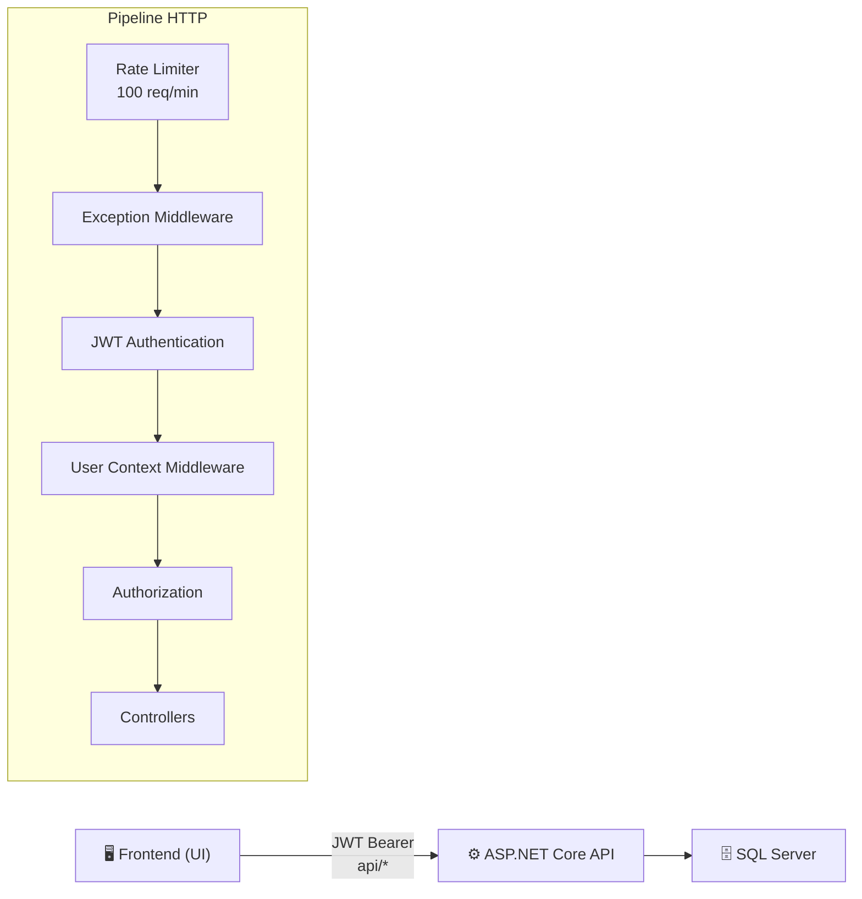
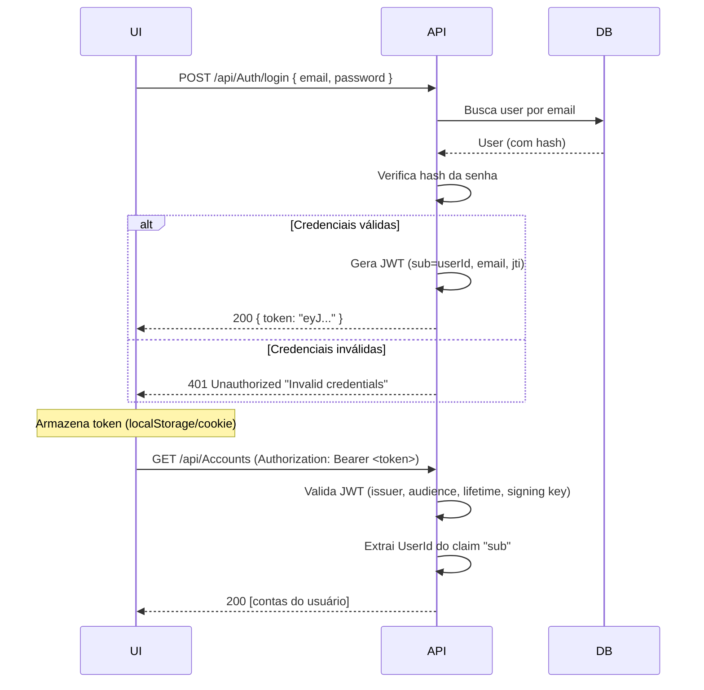

# Monetis API — Referência Completa para Construção da UI

> Documento gerado a partir da análise exaustiva do repositório `monetis`. Contém tudo que você precisa para construir o frontend: endpoints, DTOs, validações, enums, fluxo de autenticação e formato de erros.

---

## Visão Geral da Arquitetura



- **Base URL**: `api/` (todas as rotas começam com `api/`)
- **Autenticação**: JWT Bearer Token no header `Authorization: Bearer <token>`
- **Content-Type**: `application/json`
- **Rate Limit**: 100 requisições/minuto (FixedWindow), queue limit 2

---

## 1. Autenticação (JWT)

### Fluxo de Login



### Token JWT — Detalhes

| Campo                  | Valor                                        |
| ---------------------- | -------------------------------------------- |
| Algoritmo              | HMAC-SHA256                                  |
| Expiração              | 2 dias                                       |
| Claims                 | `sub` (UserId), `email`, `jti` (unique ID)   |
| Validações do servidor | Issuer, Audience, Lifetime, IssuerSigningKey |

### Endpoints Públicos (sem token)

| Endpoint               | Descrição                |
| ---------------------- | ------------------------ |
| `POST /api/Auth/login` | Login                    |
| `POST /api/Users`      | Registro de novo usuário |

> [!IMPORTANT]
> Todos os demais endpoints exigem `Authorization: Bearer <token>`.

---

## 2. Formato de Erros

A API retorna erros no seguinte formato JSON:

```json
{
  "statusCode": 400,
  "message": "Mensagem descritiva do erro",
  "errorCode": "BUSINESS_ERROR",
  "details": null,
  "stackTrace": null
}
```

### Mapeamento de Exceções → HTTP Status

| Tipo de Exceção                      | Status Code | `errorCode`       | Quando ocorre                                       |
| ------------------------------------ | ----------- | ----------------- | --------------------------------------------------- |
| `DomainException` (regra de negócio) | 400         | `BUSINESS_ERROR`  | Violação de invariante do domínio                   |
| `ArgumentException`                  | 400         | `04X0`            | Parâmetro inválido                                  |
| `KeyNotFoundException`               | 404         | `04X4`            | Recurso não encontrado (ou não pertence ao usuário) |
| Validação FluentValidation           | 400         | (ASP.NET default) | Campos do request inválidos                         |
| Qualquer outra exceção               | 500         | `07X0`            | Erro interno                                        |

> [!NOTE]
> Erros de validação do FluentValidation retornam no formato padrão do ASP.NET Core (ValidationProblemDetails) com a lista de erros por campo, **antes** de chegar ao controller.

---

## 3. Enums

Usados em diversos DTOs. A UI precisa conhecê-los para montar selects/dropdowns.

### `AccountType`

| Valor        | Index | Descrição sugerida |
| ------------ | ----- | ------------------ |
| `Checking`   | 0     | Conta Corrente     |
| `Saving`     | 1     | Poupança           |
| `CreditCard` | 2     | Cartão de Crédito  |

### `PaymentMethod`

| Valor        | Index | Descrição sugerida |
| ------------ | ----- | ------------------ |
| `Cash`       | 0     | Dinheiro           |
| `Debit`      | 1     | Débito             |
| `CreditCard` | 2     | Cartão de Crédito  |
| `Pix`        | 3     | Pix                |
| `Transfer`   | 4     | Transferência      |

### `Frequency`

| Valor        | Index | Descrição sugerida |
| ------------ | ----- | ------------------ |
| `Weekly`     | 0     | Semanal            |
| `Biweekly`   | 1     | Quinzenal          |
| `Monthly`    | 2     | Mensal             |
| `Bimonthly`  | 3     | Bimestral          |
| `Quarterly`  | 4     | Trimestral         |
| `Semiannual` | 5     | Semestral          |
| `Yearly`     | 6     | Anual              |

### `TransactionStatus`

| Valor       | Index | Cor sugerida | Descrição sugerida |
| ----------- | ----- | ------------ | ------------------ |
| `Pending`   | 0     | 🟡 Amarelo   | Pendente           |
| `Paid`      | 1     | 🟢 Verde     | Pago               |
| `Cancelled` | 2     | ⚪ Cinza     | Cancelado          |
| `Overdue`   | 3     | 🔴 Vermelho  | Vencido            |

---

## 4. Endpoints por Recurso

### 4.1 Auth — Autenticação

#### `POST /api/Auth/login` 🔓

Realiza login e retorna token JWT.

**Request:**

```typescript
// LoginUserRequest
{
  email: string; // required, email válido, max 100
  password: string; // required, min 8, max 128, deve conter: maiúscula, minúscula, número, caractere especial (@$!%*?&)
}
```

**Response (200):**

```typescript
{
  token: string; // JWT token
}
```

**Erros:** `401` — credenciais inválidas

---

### 4.2 Users — Usuários

#### `POST /api/Users` 🔓

Registra novo usuário (público).

**Request:**

```typescript
// CreateUserRequest
{
  firstName: string; // required, max 50, regex: letras, espaços, hífens, underscores
  lastName: string; // required, max 50, regex: letras, espaços, hífens, underscores
  email: string; // required, email válido, max 100
  password: string; // required, min 8, max 128, regex: maiúscula + minúscula + número + especial
}
```

**Response (201):**

```typescript
// UserResponse
{
  id: string; // GUID
  firstName: string;
  lastName: string;
  email: string;
}
```

#### `GET /api/Users/{id}` 🔒

Retorna um usuário por ID.

**Response (200):** `UserResponse`
**Erros:** `404` — não encontrado

#### `GET /api/Users` 🔒

Lista todos os usuários.

**Response (200):** `UserResponse[]`

#### `PUT /api/Users/{id}` 🔒

Atualiza um usuário.

**Request:**

```typescript
// UpdateUserRequest
{
  firstName: string; // required, max 50, regex: letras, espaços, hífens, underscores
  lastName: string; // required, max 50, regex: letras, espaços, hífens, underscores
  email: string; // required, email válido, max 100
}
```

**Response:** `204 No Content`
**Erros:** `404` — não encontrado

#### `DELETE /api/Users/{id}` 🔒

Remove um usuário.

**Response:** `204 No Content`
**Erros:** `404` — não encontrado

---

### 4.3 Accounts — Contas

#### `POST /api/Accounts` 🔒

Cria uma nova conta.

**Request:**

```typescript
// CreateAccountRequest
{
  name: string; // required, max 100, regex: letras e espaços (inclui acentos)
  type: AccountType; // required, enum válido (0=Checking, 1=Saving, 2=CreditCard)
}
```

**Response (201):**

```typescript
// AccountResponse
{
  id: string; // GUID
  name: string;
  userId: string; // GUID
  type: number; // AccountType enum
  balance: number; // decimal — saldo (inicia em 0)
}
```

#### `GET /api/Accounts` 🔒

Lista todas as contas do usuário.

**Response (200):** `AccountResponse[]`

#### `GET /api/Accounts/{id}` 🔒

Retorna uma conta por ID.

**Response (200):** `AccountResponse`
**Erros:** `404` — não encontrado

#### `PUT /api/Accounts/{id}` 🔒

Atualiza uma conta.

**Request:**

```typescript
// UpdateAccountRequest
{
  name: string; // required, max 100, regex: letras e espaços (inclui acentos)
}
```

**Response:** `204 No Content`
**Erros:** `404` — não encontrado

#### `DELETE /api/Accounts/{id}` 🔒

Remove uma conta.

**Response:** `204 No Content`

---

### 4.4 Cards — Cartões

#### `POST /api/Cards` 🔒

Cria um novo cartão.

**Request:**

```typescript
// CreateCardRequest
{
  name: string; // required (sem validador FluentValidation — validação no domínio)
}
```

**Response (201):**

```typescript
// CardResponse
{
  id: string; // GUID
  name: string;
  userId: string; // GUID
}
```

#### `GET /api/Cards` 🔒

Lista todos os cartões do usuário.

**Response (200):** `CardResponse[]`

#### `GET /api/Cards/{id}` 🔒

Retorna um cartão por ID.

**Response (200):** `CardResponse`
**Erros:** `404` — não encontrado

#### `PUT /api/Cards/{id}` 🔒

Atualiza um cartão.

**Request:**

```typescript
// UpdateCardRequest
{
  name: string; // required
}
```

**Response:** `204 No Content`
**Erros:** `404` — não encontrado

#### `DELETE /api/Cards/{id}` 🔒

Remove um cartão.

**Response:** `204 No Content`

---

### 4.5 Categories — Categorias

> [!NOTE]
> Categorias podem ser **do sistema** (`userId` nulo/vazio) ou **do usuário**. A API retorna ambas no `GetAll`. Apenas categorias do usuário podem ser editadas/excluídas.

#### `POST /api/Categories` 🔒

Cria uma nova categoria.

**Request:**

```typescript
// CreateCategoryRequest
{
  name: string; // required, max 50, regex: letras e espaços (inclui acentos)
  icon: string; // required, max 15, regex: letras, números, pontuação, símbolos, emojis
}
```

**Response (201):**

```typescript
// CategoryResponse
{
  id: string; // GUID
  name: string;
  userId: string; // GUID (vazio para categorias do sistema)
  icon: string; // emoji ou símbolo
}
```

#### `GET /api/Categories` 🔒

Lista todas as categorias (sistema + usuário).

**Response (200):** `CategoryResponse[]`

#### `GET /api/Categories/{id}` 🔒

Retorna uma categoria por ID.

**Response (200):** `CategoryResponse`
**Erros:** `404` — não encontrado

#### `PUT /api/Categories/{id}` 🔒

Atualiza uma categoria.

**Request:**

```typescript
// UpdateCategoryRequest
{
  name: string; // required, max 50, regex: letras e espaços (inclui acentos)
  icon: string; // required, max 15, regex: letras, números, pontuação, símbolos, emojis
}
```

**Response:** `204 No Content`
**Erros:** `404` — não encontrado

#### `DELETE /api/Categories/{id}` 🔒

Remove uma categoria.

**Response:** `204 No Content`

---

### 4.6 Expenses — Despesas ⭐

O recurso mais complexo da API. Suporta despesas simples, parceladas e pagamento.

#### `POST /api/Expenses` 🔒

Cria uma despesa simples.

**Request:**

```typescript
// CreateExpenseRequest
{
  accountId: string;        // GUID, required
  categoryId: string;       // GUID, required
  amount: number;           // required, > 0, <= 9.999.999.999
  description: string;      // required, max 200
  dueDate: string;          // required, ISO date, não pode ser > 1 ano no passado
  paymentMethod: number;    // required, PaymentMethod enum válido
  creditCardId?: string;    // GUID, required SE paymentMethod == CreditCard, proibido caso contrário
}
```

**Response (201):**

```typescript
// ExpenseResponse
{
  id: string;                // GUID
  accountId: string;         // GUID
  categoryId: string;        // GUID
  status: number;            // TransactionStatus enum (0=Pending ao criar)
  paidAt?: string;           // ISO date, null se não pago
  amount: number;            // decimal
  description: string;
  dueDate: string;           // ISO date
  paymentMethod: number;     // PaymentMethod enum
  installmentNumber?: number; // null para despesa simples
  totalInstallments?: number; // null para despesa simples
  installmentGroupId?: string; // GUID, null para despesa simples
  creditCardId?: string;     // GUID
}
```

#### `POST /api/Expenses/installments` 🔒

Cria despesa parcelada (2-24 parcelas). Todas usam cartão de crédito.

**Request:**

```typescript
// CreateInstallmentRequest
{
  accountId: string;         // GUID, required
  categoryId: string;        // GUID, required
  totalAmount: number;       // required, > 0, <= 9.999.999.999
  description: string;       // required, max 200
  firstDueDate: string;      // ISO date, required
  numberOfInstallments: number; // required, entre 2 e 24
  creditCardId?: string;     // GUID, required (apesar de nullable no tipo)
}
```

**Response (200):** `ExpenseResponse[]` — array com todas as parcelas criadas

> [!TIP]
> O valor total é dividido igualmente entre as parcelas (arredondado a 2 casas decimais). A diferença de centavos é somada à 1ª parcela. Cada parcela tem `installmentNumber`, `totalInstallments` e o mesmo `installmentGroupId`.

#### `POST /api/Expenses/{id}/pay` 🔒

Marca uma despesa como paga.

**Request:**

```typescript
// PayExpenseRequest
{
  paidAt: string;    // ISO date, required, não pode ser no futuro
  accountId?: string; // GUID, opcional — se informado, altera a conta da despesa
}
```

**Response (200):** `ExpenseResponse` (com `status = Paid`, `paidAt` preenchido)

**Regras de negócio:**

- Despesa já paga → erro `BUSINESS_ERROR`
- Se `accountId` informado e diferente do original, a conta é alterada

#### `PUT /api/Expenses/{id}` 🔒

Atualiza uma despesa.

**Request:**

```typescript
// UpdateExpenseRequest
{
  categoryId: string;       // GUID, required
  amount: number;           // required, > 0, <= 9.999.999.999
  description: string;      // required, max 200
  dueDate: string;          // ISO date, required, não pode ser > 1 ano no passado
  isUpdatingGroup?: boolean; // se true, atualiza todas as parcelas do grupo
}
```

**Response (200):** `ExpenseResponse`

**Regras de negócio:**

- Despesa já paga → não pode ser atualizada
- Despesa parcelada (sem `isUpdatingGroup`) → não pode ser atualizada individualmente

#### `GET /api/Expenses` 🔒

Lista todas as despesas do usuário.

**Response (200):** `ExpenseResponse[]`

#### `GET /api/Expenses/{id}` 🔒

Retorna uma despesa por ID.

**Response (200):** `ExpenseResponse`
**Erros:** `404` — não encontrado

#### `POST /api/Expenses/process-overdue` 🔒

Processa despesas vencidas manualmente (também roda automaticamente todo dia à 00:01 UTC).

**Response:** `204 No Content`

---

### 4.7 Incomes — Receitas

#### `POST /api/Incomes` 🔒

Cria uma nova receita.

**Request:**

```typescript
// CreateIncomeRequest
{
  accountId: string; // GUID, required
  categoryId: string; // GUID, required
  amount: number; // required, > 0, <= 9.999.999.999
  description: string; // required, max 200
  receivedAt: string; // ISO date, required, não pode ser no futuro
}
```

**Response (201):**

```typescript
// IncomeResponse
{
  id: string; // GUID
  accountId: string; // GUID
  categoryId: string; // GUID
  amount: number; // decimal
  description: string;
  receivedAt: string; // ISO date
}
```

#### `GET /api/Incomes` 🔒

Lista todas as receitas do usuário.

**Response (200):** `IncomeResponse[]`

#### `GET /api/Incomes/{id}` 🔒

Retorna uma receita por ID.

**Response (200):** `IncomeResponse`
**Erros:** `404` — não encontrado

#### `PUT /api/Incomes/{id}` 🔒

Atualiza uma receita.

**Request:**

```typescript
// UpdateIncomeRequest
{
  categoryId: string; // GUID, required
  amount: number; // required, > 0, <= 9.999.999.999
  description: string; // required, max 200
  receivedAt: string; // ISO date, required, não pode ser no futuro
}
```

**Response:** `204 No Content`
**Erros:** `404`, `400`

#### `DELETE /api/Incomes/{id}` 🔒

Remove uma receita.

**Response:** `204 No Content`
**Erros:** `404` — não encontrado

---

### 4.8 Transfers — Transferências entre Contas

#### `POST /api/Transfers` 🔒

Cria uma transferência entre contas.

**Request:**

```typescript
// CreateTransferRequest
{
  accountId: string; // GUID, required (conta de origem)
  destinationAccountId: string; // GUID, required, deve ser diferente de accountId
  amount: number; // required, > 0, <= 9.999.999.999
  description: string; // required, max 200
  transferredAt: string; // ISO date, required, não pode ser no futuro
}
```

**Response (201):**

```typescript
// TransferResponse
{
  id: string; // GUID
  accountId: string; // GUID (origem)
  destinationAccountId: string; // GUID (destino)
  amount: number; // decimal
  description: string;
  transferredAt: string; // ISO date
}
```

**Regras de negócio:**

- Contas devem pertencer ao mesmo usuário
- Conta de origem deve ter saldo suficiente
- Saldos são atualizados imediatamente (débito na origem, crédito no destino)

#### `GET /api/Transfers` 🔒

Lista todas as transferências do usuário.

**Response (200):** `TransferResponse[]`

#### `GET /api/Transfers/{id}` 🔒

Retorna uma transferência por ID.

**Response (200):** `TransferResponse`
**Erros:** `404` — não encontrado

#### `PUT /api/Transfers/{id}` 🔒

Atualiza uma transferência.

**Request:**

```typescript
// UpdateTransferRequest
{
  amount: number; // required, > 0, <= 9.999.999.999
  description: string; // required, max 200
}
```

**Response:** `204 No Content`
**Erros:** `404` — não encontrado

#### `DELETE /api/Transfers/{id}` 🔒

Remove uma transferência.

**Response:** `204 No Content`

> [!WARNING]
> A entidade `Transfer` suporta cancelamento (`Cancel`) com estorno de saldo, mas **somente no mesmo dia** da transferência. Esse método existe no domínio, porém não há endpoint de cancelamento exposto no controller atualmente.

---

### 4.9 Subscriptions — Assinaturas / Recorrências

#### `POST /api/Subscriptions` 🔒

Cria uma nova assinatura.

**Request:**

```typescript
// CreateSubscriptionRequest
{
  accountId: string; // GUID, required
  categoryId: string; // GUID, required
  amount: number; // required, > 0, <= 9.999.999.999
  description: string; // required, max 100, regex: letras, espaços, números, hífens, underscores
  frequency: number; // required, Frequency enum válido
  nextDueDate: string; // ISO date, required, não pode ser no passado
  paymentMethod: number; // required, PaymentMethod enum válido
}
```

**Response (201):**

```typescript
// SubscriptionResponse
{
  id: string; // GUID
  amount: number; // decimal
  description: string;
  frequency: number; // Frequency enum
  nextDueDate: string; // ISO date
  isActive: boolean; // true ao criar
}
```

#### `GET /api/Subscriptions` 🔒

Lista todas as assinaturas do usuário.

**Response (200):** `SubscriptionResponse[]`

#### `GET /api/Subscriptions/{id}` 🔒

Retorna uma assinatura por ID.

**Response (200):** `SubscriptionResponse`
**Erros:** `404` — não encontrado

#### `PUT /api/Subscriptions/{id}` 🔒

Atualiza uma assinatura.

**Request:**

```typescript
// UpdateSubscriptionRequest
{
  amount: number; // required, > 0, <= 9.999.999.999
  description: string; // required, max 100, regex: letras, espaços, números, hífens, underscores
  frequency: number; // required, Frequency enum válido
  nextDueDate: string; // ISO date, required, não pode ser no passado
  isActive: boolean; // required
}
```

**Response:** `204 No Content`
**Erros:** `404` — não encontrado

#### `DELETE /api/Subscriptions/{id}` 🔒

Remove uma assinatura.

**Response:** `204 No Content`

---

## 5. Resumo de Validações por Campo (Quick Reference)

### Campos de Texto

| Campo                        | Min | Max | Regex/Formato                              | Onde aparece              |
| ---------------------------- | --- | --- | ------------------------------------------ | ------------------------- |
| `firstName`                  | —   | 50  | `^[a-zA-Z\s\-_]+$`                         | User                      |
| `lastName`                   | —   | 50  | `^[a-zA-Z\s\-_]+$`                         | User                      |
| `email`                      | —   | 100 | Email válido                               | User, Auth                |
| `password`                   | 8   | 128 | maiúscula + minúscula + número + `@$!%*?&` | User, Auth                |
| `name` (Account)             | —   | 100 | `^[a-zA-ZÀ-ÿ\s]+$`                         | Account                   |
| `name` (Category)            | —   | 50  | `^[a-zA-ZÀ-ÿ\s]+$`                         | Category                  |
| `icon`                       | —   | 15  | `^[\p{L}\p{N}\p{P}\p{S}\p{Cs}]+$`          | Category                  |
| `description` (geral)        | —   | 200 | —                                          | Expense, Income, Transfer |
| `description` (Subscription) | —   | 100 | `^[a-zA-ZÀ-ÿ\s0-9\-_]+$`                   | Subscription              |

### Campos Numéricos

| Campo                    | Min | Max             | Onde aparece           |
| ------------------------ | --- | --------------- | ---------------------- |
| `amount` / `totalAmount` | > 0 | ≤ 9.999.999.999 | Todos os financeiros   |
| `numberOfInstallments`   | 2   | 24              | Expense (parcelamento) |

### Campos de Data

| Campo           | Regra                             | Onde aparece  |
| --------------- | --------------------------------- | ------------- |
| `dueDate`       | ≥ hoje − 1 ano                    | Expense       |
| `paidAt`        | ≤ agora                           | Expense (pay) |
| `receivedAt`    | ≤ agora                           | Income        |
| `transferredAt` | ≤ agora                           | Transfer      |
| `nextDueDate`   | ≥ agora                           | Subscription  |
| `firstDueDate`  | required (sem validação de range) | Installment   |

---

## 6. Regras de Negócio Importantes para a UI

### Despesas (Expense)

1. **Cartão de crédito condicional**: se `paymentMethod == CreditCard`, o campo `creditCardId` é **obrigatório**. Caso contrário, deve ser **nulo**.
2. **Parcelamento**: sempre via cartão de crédito, entre 2 e 24 parcelas. O valor é dividido automaticamente (centavos ajustados na 1ª parcela).
3. **Status workflow**: `Pending` → `Paid` (via `/pay`) ou `Pending` → `Overdue` (automático diário).
4. **Despesa paga não pode ser editada**.
5. **Despesa parcelada individual não pode ser editada** (use `isUpdatingGroup: true`).

### Transferências (Transfer)

1. **Conta de origem ≠ conta de destino** (validação no FluentValidation e no domínio).
2. **Saldo é movimentado imediatamente** na criação.
3. **Cancelamento só no mesmo dia** (existe no domínio, mas sem endpoint exposto).

### Receitas (Income)

1. **Data de recebimento não pode ser no futuro** (para receitas pagas).
2. O domínio suporta agendar receitas futuras (`Schedule`), mas o controller usa `CreatePaid`.

### Assinaturas (Subscription)

1. **Processamento gera despesas automaticamente** com sufixo `"(Assinatura)"`.
2. **Frequência recalcula** `nextDueDate` automaticamente.
3. Podem ser ativadas/desativadas via `isActive` no update.

### Contas (Account)

1. **Saldo inicia em 0** e é alterado por transações (despesas pagas, receitas, transferências).
2. **Pode ficar negativo** (`IsNegative` é calculado no domínio).

### Categorias (Category)

1. **Categorias do sistema** (seed): `userId` vazio/nulo — visíveis para todos, não editáveis.
2. **Categorias do usuário**: criadas pelo usuário, editáveis/deletáveis.

---

## 7. Multi-tenancy — Isolamento de Dados

> [!IMPORTANT]
> O backend filtra **todos os dados por usuário automaticamente** via query filters globais do EF Core. A UI **nunca precisa enviar o userId** no body — ele é extraído automaticamente do token JWT. Cada usuário só vê/manipula seus próprios dados.

---

## 8. DTOs Extras no Código (não expostos via controller)

Estes DTOs existem no código mas **não têm endpoints expostos atualmente**:

| DTO                              | Descrição                                                                                                                                                         |
| -------------------------------- | ----------------------------------------------------------------------------------------------------------------------------------------------------------------- |
| `ChangePasswordLoggedInRequest`  | `{ currentPassword, newPassword }`                                                                                                                                |
| `ChangePasswordLoggedOutRequest` | `{ email, newPassword }`                                                                                                                                          |
| `UpdateInstallmentGroupRequest`  | Atualização em lote de grupo de parcelas (campos: `newAccountId`, `categoryId`, `newTotalAmount`, `description`, `firstDueDate`, `paymentMethod`, `creditCardId`) |

---

## 9. Stack Técnica

| Componente       | Tecnologia               | Versão             |
| ---------------- | ------------------------ | ------------------ |
| Runtime          | .NET                     | 10.0               |
| Linguagem        | C#                       | 14                 |
| ORM              | EF Core (SQL Server)     | 10.0.5             |
| Auth             | JWT Bearer (HMAC-SHA256) | —                  |
| Validação        | FluentValidation         | 11.9.0             |
| Testes           | xUnit + FluentAssertions | 2.9.3 / 7.2.0      |
| Documentação     | Swagger/OpenAPI          | Swashbuckle 10.1.7 |
| Análise estática | SonarAnalyzer.CSharp     | 10.33.0            |

---

## 10. Checklist para a UI

- [ ] **Tela de Login**: email + password → `POST /api/Auth/login` → armazenar token
- [ ] **Tela de Registro**: firstName + lastName + email + password → `POST /api/Users`
- [ ] **Dashboard**: combinar `GET /api/Accounts` (saldos) + `GET /api/Expenses` + `GET /api/Incomes`
- [ ] **CRUD de Contas**: listar, criar (nome + tipo), editar (nome), excluir
- [ ] **CRUD de Cartões**: listar, criar (nome), editar (nome), excluir
- [ ] **CRUD de Categorias**: listar (sistema + user), criar (nome + emoji), editar, excluir (só do user)
- [ ] **CRUD de Despesas**: listar, criar (simples e parcelada), editar, pagar (`/pay`)
- [ ] **CRUD de Receitas**: listar, criar, editar, excluir
- [ ] **CRUD de Transferências**: listar, criar (origem + destino), editar, excluir
- [ ] **CRUD de Assinaturas**: listar, criar, editar (com toggle ativo/inativo), excluir
- [ ] **Tratamento de erros**: mapear `statusCode` + `errorCode` + `message` para toasts/alerts
- [ ] **Token management**: interceptor HTTP para injetar Bearer, redirect para login no 401
